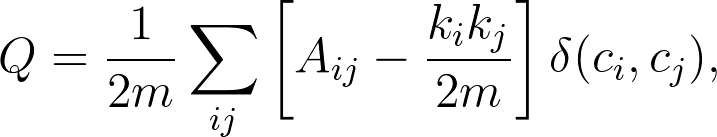

# communities

`communities` is a collection of community detection algorithms for graphs. It provides the following algorithms:

1. [Louvain's modularity](https://en.wikipedia.org/wiki/Louvain_modularity)
2. [Girvan-Newman](https://en.wikipedia.org/wiki/Girvan%E2%80%93Newman_algorithm)
3. Hierarchical clustering (TODO)
4. Minimum cut (TODO)

## Installation

`communities` can be installed with `pip`:

```bash
$ pip install communities
```

## Getting Started

Each algorithm expects an adjacency matrix representing an undirected graph. This matrix can either be left-triangular or symmetric. To get started, just import the algorithm you want to use from `communities.algorithms`, like so:

```python
from communities.algorithms import girvan_newman

adj_matrix = [...]
communities = girvan_newman(adj_matrix)
```

The output of each algorithm is a list of communities, where each community is a set of nodes.

## API

### communities.algorithms

#### `louvain_modularity(adj_matrix : list, size : int = None) -> list`

Pure Python implementation of the [Louvain method](https://en.wikipedia.org/wiki/Louvain_modularity). This algorithm does a greedy search for the community split that maximizes the modularity of the graph. A graph is said to be modular if it has a high density of intra-community edges and a low density of inter-community edges. According to Wikipedia, modularity is defined as:

<p align="left"></p>

where
* _A<sub>ij</sub>_ represents the edge weight between nodes _i_ and _j_
* _k<sub>i</sub>_ and _k<sub>j</sub>_ are the sum of the weights of the edges attached to nodes _i_ and _j_, respectively
* _m_ is the sum of all of the edge weights in the graph
* _c<sub>i</sub>_ and _c<sub>j</sub>_ are the communities of the nodes
* _δ_ is Kronecker delta function (_δ(x, y) = 1_ if _x = y_, _0_ otherwise)

#### `girvan_newman(adj_matrix : list, size : int = None) -> list`

### communities.utilities

#### `is_left_triangular(adj_matrix : list) -> bool`

#### `symmetrize_matrix(adj_matrix : list) -> list`

#### `binarize_matrix(adj_matrix : list, threshold : float = 0.0) -> list`

#### `create_intercommunity_graph(adj_matrix : list, communities : list, aggr : Callable = sum) -> list`
