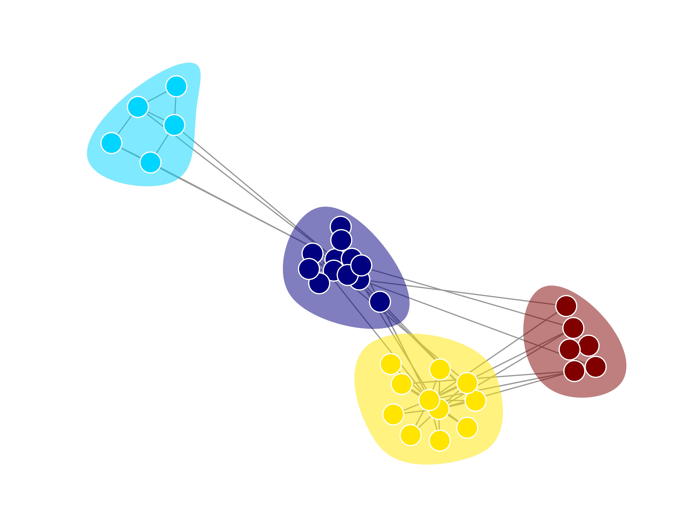
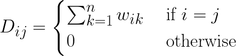
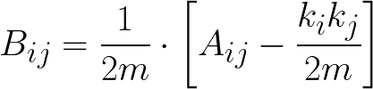

# communities

`communities` is a Python library for detecting [community structure](https://en.wikipedia.org/wiki/Community_structure) in graphs. It implements the following algorithms:

- Louvain method
- Girvan-Newman algorithm
- Hierarchical clustering
- Spectral clustering
- Bron-Kerbosch algorithm
<!-- - Minimum k-cut-->

You can also use `communities` to visualize these algorithms. For example, here's a visualization of the Louvain method applied to the [karate club graph](https://en.wikipedia.org/wiki/Zachary%27s_karate_club):


## Installation

`communities` can be installed with `pip`:

```bash
$ pip install communities
```

## Getting Started

Each algorithm expects an adjacency matrix representing an undirected graph, which can be weighted or unweighted. This matrix should be a 2D `numpy` array. Once you have this, simply import the algorithm you want to use from `communities.algorithms` and plug in the matrix, like so:

```python
import numpy as np
from communities.algorithms import louvain_method

adj_matrix = np.array([[0, 1, 1, 0, 0, 0],
                       [1, 0, 1, 0, 0, 0],
                       [1, 1, 0, 1, 0, 0],
                       [0, 0, 1, 0, 1, 1],
                       [0, 0, 0, 1, 0, 1],
                       [0, 0, 0, 1, 1, 0]])
communities, _ = louvain_method(adj_matrix)
# >>> [{0, 1, 2}, {3, 4, 5}]
```

The output of each algorithm is a list of communities, where each community is a set of nodes. Each node is referred to by the index of its row in the adjacency matrix.

Some algorithms, like `louvain_method` and `girvan_newman`, will return two values: the list of communities and data to plug into a visualization algorithm. More on this in the _Visualization_ section.

## Algorithms

### Louvain's Method

**`louvain_method(adj_matrix : numpy.ndarray, n : int = None) -> list`**

Implementation of the Louvain method, from _[Fast unfolding of communities in large networks](https://arxiv.org/pdf/0803.0476.pdf)_. This algorithm does a greedy search for the communities that maximize the modularity of the graph. A graph is said to be modular if it has a high density of intra-community edges and a low density of inter-community edges.

Louvain's method runs in _O(nᆞlog<sup>2</sup>n)_ time, where _n_ is the number of nodes in the graph.

**Parameters:**

- `adj_matrix` _(numpy.ndarray)_: Adjacency matrix representation of your graph
- `n` _(int or None, optional (default=None))_: Terminates the search once this number of communities is detected; if `None`, then the algorithm will behave normally and terminate once modularity is maximized

**Example Usage:**

```python
from communities.algorithms import louvain_method

adj_matrix = [...]
communities, _ = louvain_method(adj_matrix)
```

### Girvan-Newman algorithm

**`girvan_newman(adj_matrix : numpy.ndarray, n : int = None) -> list`**

Implementation of the Girvan-Newman algorithm, from _[Community structure in social and biological networks](https://www.pnas.org/content/99/12/7821)_. This algorithm iteratively removes edges to create more [connected components](<https://en.wikipedia.org/wiki/Component_(graph_theory)>). Each component is considered a community, and the algorithm stops removing edges when no more gains in modularity can be made. Edges with the highest betweenness centralities (i.e. those that lie between many pairs of nodes) are removed. Formally, edge betweenness centrality is defined as:

<p align="left"></p>

where

- _σ(i,j)_ is the number of shortest paths from node _i_ to _j_
- _σ(i,j|e)_ is the number of shortest paths that pass through edge _e_

The Girvan-Newman algorithm runs in _O(m<sup>2</sup>n)_ time, where _m_ is the number of edges in the graph and _n_ is the number of nodes.

**Parameters:**

- `adj_matrix` _(numpy.ndarray)_: Adjacency matrix representation of your graph
  - If your graph is weighted, then the weights need to be transformed into distances, since that's how they'll be interpreted when searching for shortest paths. One way to do this is to simply take the inverse of each weight.
- `n` _(int or None, optional (default=None))_: Terminates the search once this number of communities is detected; if `None`, then the algorithm will behave normally and terminate once modularity is maximized

**Example Usage:**

```python
from communities.algorithms import girvan_newman

adj_matrix = [...]
communities, _ = girvan_newman(adj_matrix)
```

### Hierarchical clustering

**`hierarchical_clustering(adj_matrix : numpy.ndarray, metric : str = "cosine", linkage : str = "single", n : int = None) -> list`**

Implementation of a bottom-up, hierarchical clustering algorithm. Each node starts in its own community. Then, the most similar pairs of communities are merged as the hierarchy is built up. Communities are merged until no further gains in modularity can be made.

There are multiple schemes for measuring the similarity between two communities, _C<sub>1</sub>_ and _C<sub>2</sub>_:

- **Single-linkage:** min({sim(i, j) | i ∊ C<sub>1</sub>, j ∊ C<sub>2</sub>})
- **Complete-linkage:** max({sim(i, j) | i ∊ C<sub>1</sub>, j ∊ C<sub>2</sub>})
- **Mean-linkage:** mean({sim(i, j) | i ∊ C<sub>1</sub>, j ∊ C<sub>2</sub>})

where _sim(i, j)_ is the similarity between nodes _i_ and _j_, defined as either the cosine similarity or inverse Euclidean distance between their row vectors in the adjacency matrix, _A<sub>i</sub>_ and _A<sub>j</sub>_.

This algorithm runs in _O(n<sup>3</sup>)_ time, where _n_ is the number of nodes in the graph.

**Parameters:**

- `adj_matrix` _(numpy.ndarray)_: Adjacency matrix representation of your graph
- `metric` _(str, optional (default="cosine"))_: Scheme for measuring node similarity; options are "cosine", for cosine similarity, or "euclidean", for inverse Euclidean distance
- `linkage` _(str, optional (default="single"))_: Scheme for measuring community similarity; options are "single", "complete", and "mean"
- `n` _(int or None, optional (default=None))_: Terminates the search once this number of communities is detected; if `None`, then the algorithm will behave normally and terminate once modularity is maximized

**Example Usage:**

```python
from communities.algorithms import hierarchical_clustering

adj_matrix = [...]
communities = hierarchical_clustering(adj_matrix, metric="euclidean", linkage="complete")
```

### Spectral clustering

**`spectral_clustering(adj_matrix : numpy.ndarray, k : int) -> list`**

Implementation of a spectral clustering algorithm. This type of algorithm assumes the eigenvalues of the adjacency matrix hold information about community structure. Here's how it works:

1. Compute the Laplacian matrix, _L = D - A_, where _A_ is the adjacency matrix and _D_ is the diagonal matrix
2. Compute the _k_ smallest eigenvectors of _L_, skipping the first eigenvector
3. Create a matrix _V_ containing eigenvectors _v<sub>1</sub>_, _v<sub>2</sub>_, ... _v<sub>n</sub>_ as columns
4. Cluster the rows in _V_ using k-means into _k_ communities

This algorithm is NP-hard.

**Parameters:**

- `adj_matrix` _(numpy.ndarray)_: Adjacency matrix representation of your graph
- `k` _(int)_: Number of communities to cluster nodes into

**Example Usage:**

```python
from communities.algorithms import spectral_clustering

adj_matrix = [...]
communities = spectral_clustering(adj_matrix, k=5)
```

### Bron-Kerbosch algorithm

**`bron_kerbosch(adj_matrix : numpy.ndarray, pivot : bool = False) -> list`**

Implementation of the [Bron-Kerbosch algorithm](https://en.wikipedia.org/wiki/Bron%E2%80%93Kerbosch_algorithm) for maximal clique detection. A maximal clique in a graph is a subset of nodes that forms a complete graph and would no longer be complete if any other node was added to the subset. Treating maximal cliques as communities is reasonable, as cliques are the most densely connected groups of nodes in a graph. Because a node can be a member of more than one clique, this algorithm will sometimes identify overlapping communities.

<!--TODO: Given a brief overview of how the algorithm works-->
<!--TODO: Explain the `pivot` argument-->

If your input graph has less than _3<sup>n/3</sup>_ maximal cliques, then this algorithm runs in _O(3<sup>n/3</sup>)_ time (assuming `pivot=True`).

**Parameters:**

- `adj_matrix` _(numpy.ndarray)_: Adjacency matrix representation of your graph
  - Note that this algorithm treats the graph as unweighted
- `pivot` _(bool, optional (default=False))_: If `True`, the pivot variant of the algorithm (described [here](https://en.wikipedia.org/wiki/Bron%E2%80%93Kerbosch_algorithm#With_pivoting)) will be used
  - This will make the algorithm more efficient if your graph has several non-maximal cliques

**Example Usage:**

```python
from communities.algorithms import bron_kerbosch

adj_matrix = [...]
communities = bron_kerbosch(adj_matrix, pivot=True)
```

## Visualization

### Plot communities

**`draw_communities(adj_matrix : numpy.ndarray, communities : list, dark : bool = False, filename : str = None, seed : int = 1)`**

Visualize your graph such that nodes are grouped into their communities and color-coded.

Returns a `matplotlib.axes.Axes` representing the plot.

**Parameters:**

- `adj_matrix` _(numpy.ndarray)_: Adjacency matrix representation of your graph
- `dark` _(bool, optional (default=False))_: If `True`, the plot will have a dark background and color scheme, else it will have a light color scheme
- `filename` _(str or None, optional (default=None))_: If you want to save the plot as a PNG, `filename` is the path of the file to save it as; set to `None` to display the plot interactively
- `dpi` _(int or None, optional (default=None))_: Dots per inch (controls the resolution of the image)
- `seed` _(int, optional (default=2))_: Random seed

**Example Usage:**

```python
from communities.algorithms import louvain_method
from communities.visualization import draw_communities

adj_matrix = [...]
communities, frames = louvain_method(adj_matrix)

draw_communities(adj_matrix, communities)
```

<p align="center"></p>

### Animate the Louvain method

**`louvain_animation(adj_matrix : numpy.ndarray, frames : list, dark : bool = False, duration : int = 15, filename : str = None, dpi : int = None, seed : int = 2)`**

Use this to animate the application of the Louvain method to your graph. In this animation, the color of each node represents the community it's assigned to, and nodes in the same community are clustered together. Each step of the animation will show a node changing color (i.e. being assigned to a different community) and being moved to a new cluster, and the corresponding update to the graph's modularity.

This function returns a `matplotlib.animation.FuncAnimation` object representing the animation.

**Parameters:**

- `adj_matrix` _(numpy.ndarray)_: Adjacency matrix representation of your graph
- `frames` _(list)_: List of dictionaries representing each iteration of the algorithm
  - Each dictionary has two keys: `"C"`, which holds a node-to-community lookup table, and `"Q"`, the modularity value of the graph
  - This list of dictionaries is the second return value of the `louvain_method`
- `dark` _(bool, optional (default=False))_: If `True`, the animation will have a dark background and color scheme, else it will have a light color scheme
- `duration` _(int, optional (default=15))_: The desired duration of the animation in seconds
- `filename` _(str or None, optional (default=None))_: If you want to save the animation as a GIF, `filename` is the path of the file to save it as; set to `None` to display the animation as an interactive plot
- `dpi` _(int or None, optional (default=None))_: Dots per inch (controls the resolution of the animation)
- `seed` _(int, optional (default=2))_: Random seed

**Example Usage:**

```python
from communities.algorithms import louvain_method
from communities.visualization import louvain_animation

adj_matrix = [...]
communities, frames = louvain_method(adj_matrix)

louvain_animation(adj_matrix, frames)
```


## Utilities

### Inter-community adjacency matrix

**`intercommunity_matrix(adj_matrix : numpy.ndarray, communities : list, aggr : Callable = sum) -> numpy.ndarray`**

Creates an inter-community adjacency matrix. Each node in this matrix represents a community in `communities`, and each edge between nodes _i_ and _j_ is created by aggregating (e.g. summing) the weights of edges between nodes in `communities[i]` and nodes in `communities[j]`.

**Parameters:**

- `adj_matrix` _(numpy.ndarray)_: Adjacency matrix representation of the graph from which communities were extracted
- `communities` _(list)_: List of communities
- `aggr` _(Callable, optional (default=sum))_: Function that takes a list of inter-community edge weights and combines them into a single edge weight

**Example Usage:**

```python
from statistics import mean
from communities.algorithms import louvain_method
from communities.utilities import intercommunity_matrix

adj_matrix = [...]
communities = louvain_method(adj_matrix)
intercomm_adj_matrix = intercommunity_matrix(adj_matrix, communities, mean)
```

### Graph Laplacian

**`laplacian_matrix(adj_matrix : numpy.ndarray) -> numpy.ndarray`**

Computes the [graph Laplacian](https://en.wikipedia.org/wiki/Laplacian_matrix). This matrix is used in the `spectral_clustering` algorithm, and is generally useful for revealing properties of a graph. It is defined as _L = D - A_, where _A_ is the adjacency matrix of the graph, and _D_ is the degree matrix, defined as:

<p align="left"></p>

where _w<sub>ik</sub>_ is the edge weight between a node _i_ and its neighbor _k_.

**Parameters:**

- `adj_matrix` _(numpy.ndarray)_: Adjacency matrix representation of your graph

**Example Usage:**

```python
from communities.utilities import laplacian_matrix

adj_matrix = [...]
L = laplacian_matrix(adj_matrix)
```

### Modularity matrix

**`modularity_matrix(adj_matrix : numpy.ndarray) -> numpy.ndarray`**

Computes the modularity matrix for a graph. The modularity matrix is defined as:

<p align="left"></p>

where

- _A<sub>ij</sub>_ is the weight of the edge between nodes _i_ and _j_
- _k<sub>i</sub>_ and _k<sub>j</sub>_ are the sum of the weights of the edges attached to nodes _i_ and _j_, respectively
- _m_ is the sum of all of the edge weights in the graph

**Parameters:**

- `adj_matrix` _(numpy.ndarray)_: Adjacency matrix representation of your graph

### Modularity

**`modularity(mod_matrix : numpy.ndarray, communities : list) -> float`**

Computes modularity of a partitioned graph. Modularity is defined as:

<p align="left"></p>

where

- _A<sub>ij</sub>_ is the weight of the edge between nodes _i_ and _j_
- _k<sub>i</sub>_ and _k<sub>j</sub>_ are the sum of the weights of the edges attached to nodes _i_ and _j_, respectively
- _m_ is the sum of all of the edge weights in the graph
- _c<sub>i</sub>_ and _c<sub>j</sub>_ are the communities of the nodes
- _δ_ is the Kronecker delta function (_δ(x, y) = 1_ if _x = y_, _0_ otherwise)

**Parameters:**

- `mod_matrix` _(numpy.ndarray)_: Modularity matrix computed from the adjacency matrix representation of your graph
- `communities` _(list)_: List of (non-overlapping) communities identified in the graph

**Example Usage:**

```python
from communities.algorithms import louvain_method
from communities.utilities import modularity_matrix, modularity

adj_matrix = [...]
communities = louvain_method(adj_matrix)

mod_matrix = modularity_matrix(adj_matrix)
Q = modularity(mod_matrix, communities)
```

# Authors

`communities` was created by Jonathan Shobrook with the help of [Paul C. Bogdan](https://github.com/paulcbogdan/) as part of our research in the [Dolcos Lab](https://dolcoslab.beckman.illinois.edu/) at the Beckman Institute for Advanced Science and Technology.
