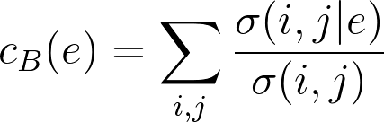

# communities

`communities` is a small library of community detection algorithms for graphs. It provides some utilities for working with graphs and the following algorithms:

1. Louvain method
2. Girvan-Newman algorithm
3. Single-linkage clustering (TODO)
4. Karger's algorithm (TODO)
5. Bron-Kerbosch algorithm (TODO)

## Installation

`communities` can be installed with `pip`:

```bash
$ pip install communities
```

## Getting Started

Each algorithm expects an adjacency matrix representing an undirected graph. This matrix can either be left-triangular or symmetric. To get started, just import the algorithm you want to use from `communities.algorithms`, like so:

```python
from communities.algorithms import louvain_method

adj_matrix = [
    [0.0],
    [1.0, 0.0],
    [1.0, 1.0, 0.0],
    [0.0, 0.0, 1.0, 0.0],
    [0.0, 0.0, 0.0, 1.0, 0.0],
    [0.0, 0.0, 0.0, 1.0, 1.0, 0.0]
]
communities = louvain_method(adj_matrix)
# >>> [[0, 1, 2], [3, 4, 5]]
```

The output of each algorithm is a list of communities, where each community is a set of nodes.

## API

### communities.algorithms

#### `louvain_method(adj_matrix : list, size : int = None) -> list`

Pure Python implementation of the [Louvain method](https://en.wikipedia.org/wiki/Louvain_modularity). This algorithm does a greedy search for the communities that maximize the modularity of the graph. A graph is said to be modular if it has a high density of intra-community edges and a low density of inter-community edges. Formally, modularity is defined as:

<p align="left"></p>

where
* _A<sub>ij</sub>_ represents the edge weight between nodes _i_ and _j_
* _k<sub>i</sub>_ and _k<sub>j</sub>_ are the sum of the weights of the edges attached to nodes _i_ and _j_, respectively
* _m_ is the sum of all of the edge weights in the graph
* _c<sub>i</sub>_ and _c<sub>j</sub>_ are the communities of the nodes
* _δ_ is the Kronecker delta function (_δ(x, y) = 1_ if _x = y_, _0_ otherwise)

Louvain's method runs in _O(nᆞlog<sup>2</sub>n)_ time, where _n_ is the number of nodes in the graph.

(Source: Wikipedia)

**Parameters:**

* `adj_matrix` _(list)_: Adjacency matrix representation of your graph; can be either a left-triangular or symmetric matrix
* `size` _(int or None, optional (default=None))_: Number of communities to divide the graph into; if `None`, then the algorithm will behave normally

**Example Usage:**

```python
from communities.algorithms import louvain_method

adj_matrix = [...]
communities = louvain_method(adj_matrix)
```

#### `girvan_newman(adj_matrix : list, size : int = None) -> list`

Implementation of the [Girvan-Newman algorithm](https://en.wikipedia.org/wiki/Girvan%E2%80%93Newman_algorithm) using NetworkX. This algorithm iteratively removes edges to create more connected components. Each component is a community, and the algorithm stops removing edges when no more gains in modularity can be made. Which edges to remove is decided by calculating their betweenness centralities, defined as:

<p align="left"></p>

where
* _σ(i,j)_ is the number of shortest paths from node _i_ to _j_
* _σ(i,j|e)_ is the number of shortest paths that pass through edge _e_

(Source: Wikipedia)

> Note: If your graph is weighted, then the weights need to be transformed into distances, since that's how they'll be interpreted when searching for shortest paths. One way to do this is to simply take the inverse of each weight.

**Parameters:**

* `adj_matrix` _(list)_: Adjacency matrix representation of your graph; can be either a left-triangular or symmetric matrix
* `size` _(int or None, optional (default=None))_: Number of communities to divide the graph into; if `None`, then the algorithm will behave normally

**Example Usage:**

```python
from communities.algorithms import girvan_newman

adj_matrix = [...]
communities = girvan_newman(adj_matrix)
```

### communities.utilities

#### `is_left_triangular(adj_matrix : list) -> bool`

This checks if your adjacency matrix is left-triangular.

#### `symmetrize_matrix(adj_matrix : list) -> list`

If your adjacency matrix is left-triangular, this function will turn it into a symmetric matix.

#### `binarize_matrix(adj_matrix : list, threshold : float = 0.0) -> list`

This function converts a weighted graph into an unweighted graph by removing edges with weights below a given threshold.

#### `create_intercommunity_graph(adj_matrix : list, communities : list, aggr : Callable = sum) -> list`